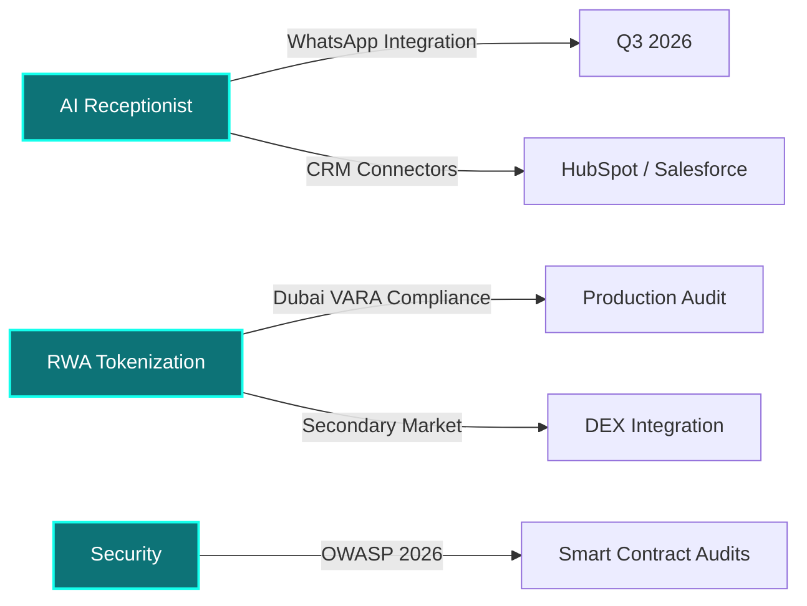

<div align="center">

# 👋 Hey, I'm **Steph Rayan**

### AI Voice Agent Developer · Smart Contract Security Auditor · Dubai Builder

</div>

---

## 🎯 The Mission

> *"Most developers build apps. I build **infrastructure that never sleeps** — AI receptionists that answer at midnight, smart contracts that secure millions in real estate, and systems that clinics in Dubai rely on before their first coffee."*

I operate at the intersection of **AI orchestration** and **Web3 security**.

---

## 🏗️ Signature Builds

### 🤖 AI Receptionist Pro
*Freelance AI Voice Agent Toolkit — Deployed in 48 Hours*

```
Patient calls at 2 AM → Vapi AI answers in Arabic → 
Books into Google Calendar → SMS confirmation sent → 
Doctor sees it Monday morning. Zero humans involved.
```

| | |
|:---|:---|
| **Stack** | FastAPI + Vapi + Twilio + Google Calendar API |
| **Model** | `$2,500` one-time setup. Client pays consumption directly. |
| **Target** | Clinics, dental practices, SMEs across Dubai & GCC |
| **Repo** | [github.com/mailtkarim-bot/AI_Receptionist_Pro](https://github.com/mailtkarim-bot/AI_Receptionist_Pro) |

### 🏙️ Dubai Real Estate Tokenization V3
*Institutional-Grade RWA Platform*

```
Physical property → On-chain ERC-3643 token → 
Fractional ownership → KYC/AML compliant → 
Dubai VARA regulated. Institutional ready.
```

| | |
|:---|:---|
| **Stack** | Solidity · Foundry · OpenZeppelin · Chainlink Oracles |
| **Standard** | ERC-3643 T-REX (permissioned tokens) |
| **Security** | ≥95% test coverage · Fuzzing · Invariant testing · OWASP 2026 aligned |
| **Repo** | [github.com/mailtkarim-bot/Dubai-Real-Estate-Token-V3](https://github.com/mailtkarim-bot/Dubai-Real-Estate-Token-V3) |

---

## 🛠️ Arsenal

| **AI & Voice** | **Backend & Cloud** | **Web3 & Security** | **DevOps & QA** |
|:---|:---|:---|:---|
| Vapi.ai · Twilio | FastAPI · Python 3.12 | Solidity · Foundry | GitHub Actions |
| LLM Orchestration | Render · Railway | ERC-3643 T-REX | Docker · CI/CD |
| STT/TTS Pipelines | OAuth 2.0 · REST APIs | Slither · Echidna | pytest · Coverage |
| Multilingual NLP | Pydantic · Uvicorn | OpenZeppelin · UUPS | Fuzzing · Invariants |

---

## 🗺️ Current Focus



---

## 🌍 Where I Operate

| 🏢 **Base** | 🌐 **Remote** | ⏰ **Availability** |
|:---:|:---:|:---:|
| Dubai, UAE | Worldwide | Sun–Thu, 9 AM – 6 PM GST |
| | | Fri–Sat: Async / Emergency |

---

## 📡 Connect

**For AI Voice Agent projects:** `$2,500` setup + `$100/hr` custom modifications  
**For Smart Contract Audits:** Scoped per project — Foundry + Echidna + Slither  
**For RWA Tokenization:** End-to-end from Solidity to VARA compliance

<div align="center">

[GitHub Profile](https://github.com/mailtkarim-bot) · [AI Receptionist Pro](https://github.com/mailtkarim-bot/AI_Receptionist_Pro) · [Dubai RWA Token](https://github.com/mailtkarim-bot/Dubai-Real-Estate-Token-V3)

</div>

---

<div align="center">

**Built with precision. Deployed with confidence. Secured by design.**

*"The future belongs to those who build systems that outlast their sleep."*

</div>
